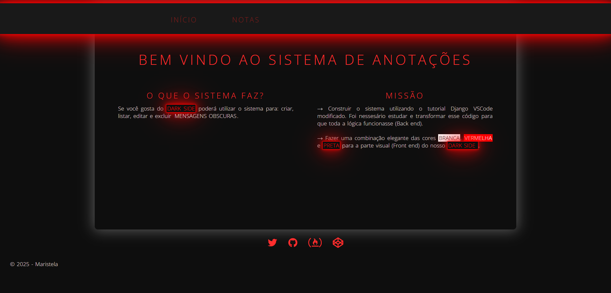
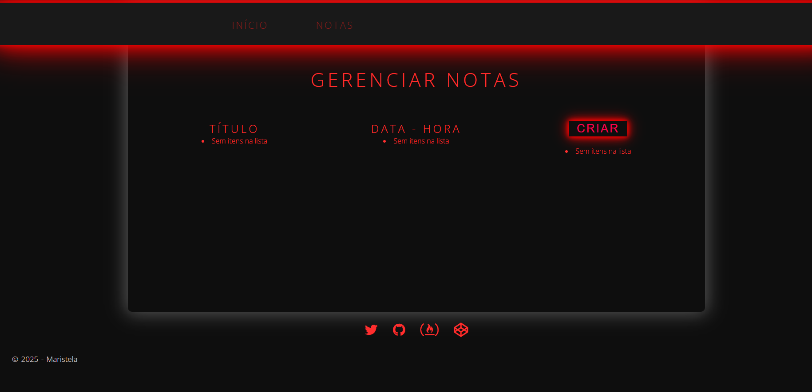
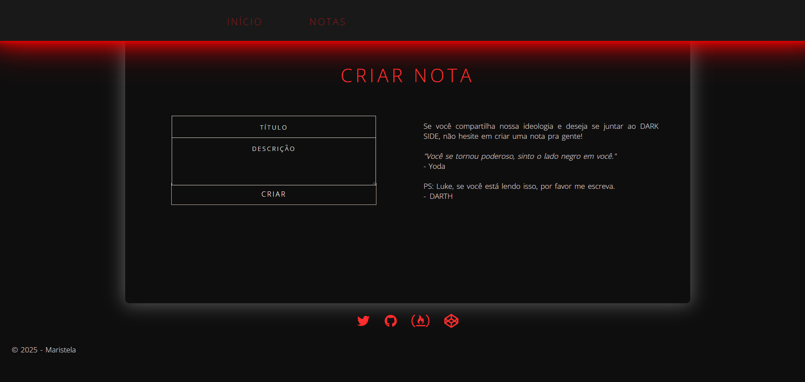
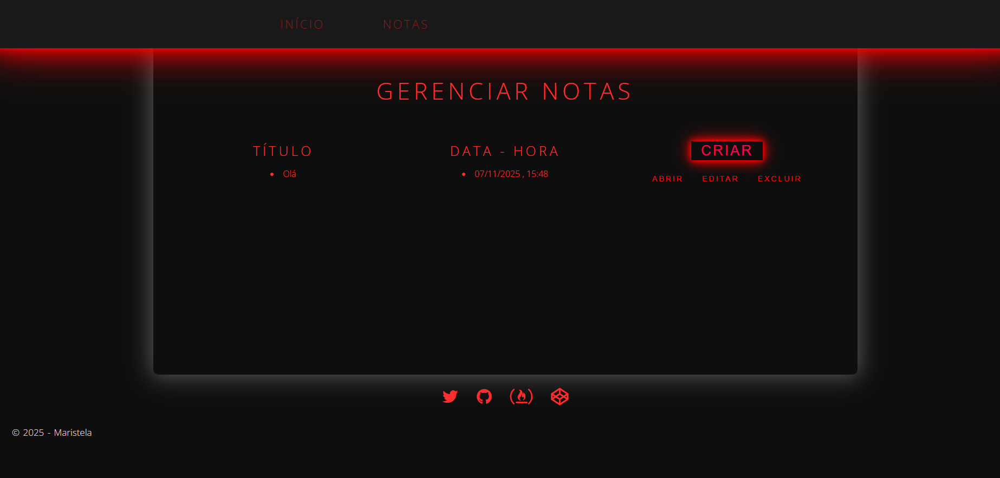

# Tutorial Django + VS Code (Sistema de Notas)

    

Este repositório contém um mini projeto Django usado como tutorial simplificado para quem está iniciando com Django dentro do VS Code. A aplicação permite que qualquer usuário:

- Liste notas cadastradas
- Adicione novas notas (titulo + descrição; data e hora são preenchidas automaticamente)
- Visualize detalhes de uma nota
- Edite uma nota existente
- Exclua uma nota

As notas são persistidas em SQLite por padrão no ambiente de desenvolvimento (arquivo `db.sqlite3`). Em produção, este sistema foi deployado no Microsoft Azure; o banco de dados de produção é MySQL (hospedado no Azure). O site em produção está disponível em: https://tutorialdjangovscode.stela.tec.br/

## Funcionalidades

- CRUD completo de notas
- Ordenação por data (mais recentes primeiro)
- Templates simples usando HTML + CSS estático
- Admin Django disponível em `/admin/`
- Servir arquivos estáticos (Whitenoise já presente para futura publicação)

## Stack Técnica

| Camada | Tecnologia |
| ------ | ---------- |
| Backend | Django |
| Banco | SQLite (desenvolvimento: `db.sqlite3`) / MySQL (produção: Azure Database for MySQL) |
| Cloud / Deploy | Microsoft Azure (Web App / App Service) |
| Front-end | Templates Django + CSS simples |
| Gerenciamento estático | Whitenoise / `STATICFILES_DIRS` |
| Ambiente | Python (requirements em `requirements.txt`) |

## Modelo de Dados

`Notas` (arquivo `notas/models.py`):

- `data: DateField` (default = data de criação)
- `hora: TimeField` (default = hora de criação)
- `titulo: CharField(100)`
- `descricao: TextField`

## Rotas Principais

| Rota | Nome | Método(s) | Descrição |
| ---- | ---- | --------- | --------- |
| `/` | `home` | GET | Página inicial simples |
| `/notas` | `notas` | GET | Lista todas as notas (mais recentes primeiro) |
| `/adiciona/` | `adiciona` | GET, POST | Formulário para criar nova nota |
| `/edita/<nr_item>` | `edita` | GET, POST | Edita nota existente |
| `/deleta/<nr_item>` | `deleta` | GET, POST | Confirma e exclui nota |
| `/visualiza/<nr_item>` | `visualiza` | GET | Detalhes de uma nota |
| `/admin/` | - | GET | Interface administrativa do Django |

## Pré-requisitos

- Python 3.11+ (recomendado)
- VS Code (extensão Python opcional para melhor experiência)

## Instalação e Execução

Clone o repositório:

```bash
git clone https://github.com/MARISTELAOLIVEIRA/DjangoVSCode.git
cd DjangoVSCode
```

Crie (opcional) e ative um ambiente virtual:

```bash
python -m venv .venv
source .venv/bin/activate
```

Instale dependências:

```bash
pip install -r requirements.txt
```

Realize migrações (caso ainda não existam):

```bash
python manage.py migrate
```

Crie um superusuário (para acessar `/admin/`):

```bash
python manage.py createsuperuser
```

Execute o servidor de desenvolvimento:

```bash
python manage.py runserver
```

Acesse em: `http://127.0.0.1:8000/`

## Screenshots

Interface rápida do sistema (imagens adicionadas à raiz do projeto):

| Tela | Imagem |
| ---- | ------ |
| Lista de notas |  |
| Adicionar nota |  |
| Visualizar nota |  |
| Editar/Excluir |  |

> Caso as imagens não apareçam, verifique se os arquivos `img1.png` ... `img4.png` existem na raiz. Em publicação externa (por exemplo GitHub Pages) garanta que o case dos nomes coincide.

## Estrutura Simplificada

```text
gerenciador/        # Configurações globais do projeto Django
notas/              # App principal (models, views, urls, templates)
templates/          # Overrides administrativos + base
static/             # Arquivos CSS do app
staticfiles/        # Coleta de estáticos (pasta gerada em execução collectstatic/admin)
```

## Desenvolvimento no VS Code

- Abra a pasta do projeto no VS Code.
- Use a paleta (Ctrl+Shift+P) para selecionar o interpretador Python do ambiente virtual.
- Rode e debuge com `Python: Django` (se extensão Python estiver instalada) ou via terminal integrado.

## Próximos Passos / Ideias

- Paginação da lista de notas
- Filtro por título / busca textual
- Autenticação de usuários (associar notas por usuário)
- API REST (Django REST Framework)
- Testes automatizados (ver arquivo inicial `notas/tests.py`)

## Licença

Projeto de demonstração educacional. Adapte livremente para estudo.

---

Se encontrar algum problema ou tiver sugestão, abra uma issue ou envie um PR. Bons estudos com Django! 🎓
